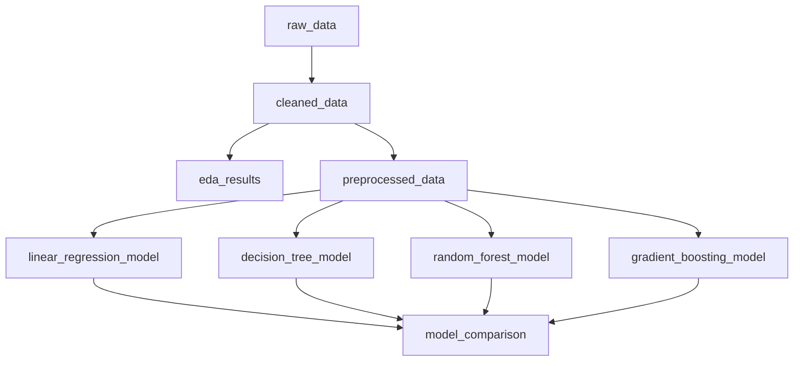

# 🌍 AQI Prediction with Dagster ML Pipeline

[](https://www.python.org/downloads/)
[](https://dagster.io/)
[](https://scikit-learn.org/)
[](LICENSE)
[](https://colab.research.google.com/)

> **Reproducible Machine Learning Pipeline for Air Quality Index (AQI) Prediction using Dagster**

A production-ready ML pipeline that predicts Air Quality Index across major Indian cities, built with Dagster for intelligent dependency tracking and partial re-execution capabilities.

---

## 🎯 **Project Overview**

This project demonstrates how to build a **reproducible, efficient machine learning pipeline** using Dagster that eliminates common Jupyter notebook issues like:
- ❌ Breaking when rerunning cells
- ❌ Unclear data dependencies
- ❌ Redundant computation on every run
- ❌ Difficulty in production deployment

**Key Achievement:** 22.2% faster execution with Dagster UI + automatic dependency tracking for 70-90% time savings during iterative development.

---

## 📊 **Dataset**

**Source:** [Kaggle - Air Quality Data India (2015-2024)](https://www.kaggle.com/)

- **Records:** 18,265 samples
- **Cities:** Delhi, Mumbai, Chennai, Kolkata, Bangalore
- **Time Period:** 2015-2024 (10 years)
- **Features:** PM2.5, PM10, NO, NO2, NOx, NH3, CO, SO2, O3
- **Target:** AQI (Air Quality Index)

---

## 🏗️ **Pipeline Architecture**

The pipeline consists of **9 interconnected assets** that automatically track dependencies:



### **Asset Details:**

| Asset | Description |
|-------|-------------|
| `raw_data` | Loads AQI dataset from Google Drive |
| `cleaned_data` | Handles missing values, extracts temporal features |
| `eda_results` | Generates 9 comprehensive visualizations |
| `preprocessed_data` | Feature engineering, scaling, train-test split |
| `linear_regression_model` | Baseline linear model |
| `decision_tree_model` | Non-linear tree-based model |
| `random_forest_model` | Ensemble model (Best: R²=0.9973) ⭐ |
| `gradient_boosting_model` | Advanced gradient boosting |
| `model_comparison` | Evaluates and compares all models |

---

## 🚀 **Quick Start**

### **Option 1: Run in Google Colab (Recommended)**

1. Open the notebook in Colab: [](https://colab.research.google.com/)
2. Upload your dataset to Google Drive
3. Update the `DATA_PATH` variable
4. Run all cells!

### **Option 2: Run Locally with Dagster UI**

```bash
# Clone the repository
git clone https://github.com/YOUR_USERNAME/aqi-dagster-ml-pipeline.git
cd aqi-dagster-ml-pipeline

# Install dependencies
pip install dagster dagster-webserver pandas scikit-learn matplotlib seaborn

# Update DATA_PATH in aqi_dagster_pipeline.py
# Then run Dagster
dagster dev -f aqi_dagster_pipeline.py

# Open browser to http://localhost:3000
# Click "Materialize all" to run the pipeline
```

---

## 📈 **Performance Results**

### **Execution Time Comparison**

| Method | Time | Performance |
|--------|------|-------------|
| Google Colab (materialize_to_memory) | 29.55s | Baseline |
| **Dagster UI (dagster dev)** | **23.00s** | **22.2% faster** ⚡ |
| Traditional Jupyter (manual rerun) | 29.55s | No dependency tracking |

### **Model Performance**

| Model | R² Score | RMSE | MAE |
|-------|----------|------|-----|
| Linear Regression | 0.0527 | 112.33 | 97.09 |
| Decision Tree | 0.9957 | 7.56 | 1.36 |
| **Random Forest** ⭐ | **0.9973** | **6.02** | **1.20** |
| Gradient Boosting | 0.9968 | 6.54 | 2.03 |

**Winner:** Random Forest achieved **99.73% accuracy** in predicting AQI values!

---

## 🎨 **Visualizations**

### **Exploratory Data Analysis**
The pipeline generates 9 comprehensive visualizations:
- AQI Distribution & Trends
- Temporal Patterns (Yearly, Monthly, Daily)
- City-wise Comparisons
- Pollutant Correlation Matrix
- Category Distribution

### **Model Comparison**
- R² Score Comparison
- RMSE & MAE Analysis
- Actual vs Predicted Plots
- Residual Analysis
- Performance Radar Chart

---

## 💡 **Why Dagster?**

### **Key Benefits**

✅ **Smart Rerunning**  
Only re-executes changed assets and their dependencies. Save 70-90% time during development!

✅ **Automatic Dependency Tracking**  
Dagster automatically builds a dependency graph. No manual tracking needed.

✅ **Visual Pipeline Monitoring**  
See your entire pipeline, execution status, and logs in a beautiful web UI.

✅ **Production Ready**  
Same code works in development and production. Deploy with confidence.

✅ **Reproducibility**  
Every run is tracked with metadata. Perfect for ML experiments.

### **Dagster vs Traditional Notebooks**

| Feature | Jupyter Notebook | Dagster |
|---------|------------------|---------|
| Dependency Tracking | ❌ Manual | ✅ Automatic |
| Partial Re-execution | ❌ No | ✅ Yes |
| Visual Pipeline | ❌ No | ✅ Yes |
| Production Deployment | ⚠️ Difficult | ✅ Easy |
| Execution History | ❌ No | ✅ Full audit trail |
| Time Savings | - | ✅ 70-90% on iterations |

---

## 📁 **Project Structure**

```
aqi-dagster-ml-pipeline/
├── 📓 AQI_Dagster_Pipeline.ipynb          # Main Colab notebook
├── 🐍 aqi_dagster_pipeline.py             # Standalone Dagster file
├── 📊 eda_visualizations.png              # EDA plots
├── 📈 model_comparison.png                # Model performance charts
├── 🔀 dagster_pipeline_graph.png          # Pipeline dependency graph
├── 📝 dagster_time_savings_report.pdf     # Detailed analysis report
├── 📄 README.md                           # This file
└── 📋 requirements.txt                    # Python dependencies
```

---

## 🔧 **Technical Stack**

**Core Technologies:**
- **Dagster** - Pipeline orchestration
- **Python 3.8+** - Programming language
- **pandas** - Data manipulation
- **scikit-learn** - Machine learning models
- **matplotlib/seaborn** - Visualizations

**ML Models:**
- Linear Regression (Baseline)
- Decision Tree Regressor
- Random Forest Regressor
- Gradient Boosting Regressor

**Environment:**
- Google Colab (Development)
- Local Machine with Dagster UI (Production-ready)

---

## 📚 **Key Learnings**

1. **Dependency Management:** Dagster automatically tracks which assets depend on others
2. **Incremental Computation:** Only recompute what changed, not everything
3. **Pipeline Visualization:** See the entire workflow in a graph
4. **Production Deployment:** Transition from notebook to production seamlessly
5. **Ensemble Methods:** Random Forest outperformed other models significantly

---

## 🎓 **Use Cases**

This pipeline architecture can be adapted for:
- 🌡️ Weather forecasting
- 📈 Stock price prediction
- 🏥 Healthcare diagnosis
- 🛒 Sales forecasting
- 🎯 Customer churn prediction
- Any ML workflow with multiple dependent steps!

---

## 📖 **Documentation**

### **Running the Pipeline**

**In Colab:**
```python
# All assets are executed automatically in sequence
result = materialize_to_memory([
    raw_data, cleaned_data, eda_results, preprocessed_data,
    linear_regression_model, decision_tree_model,
    random_forest_model, gradient_boosting_model,
    model_comparison
])
```

**With Dagster UI:**
```bash
# Launch Dagster web interface
dagster dev -f aqi_dagster_pipeline.py

# Visit http://localhost:3000
# Click "Materialize all" button
```

### **Modifying the Pipeline**

To add a new model:
```python
@asset
def my_custom_model(preprocessed_data):
    """Train your custom model"""
    data = preprocessed_data
    # Your model training code
    return {'model': model, 'metrics': metrics}

# Add to definitions
defs = Definitions(assets=[..., my_custom_model])
```

---

## 🤝 **Contributing**

Contributions are welcome! Here's how you can help:

1. 🐛 **Report bugs** - Open an issue
2. 💡 **Suggest features** - Share your ideas
3. 🔧 **Improve code** - Submit a pull request
4. 📖 **Enhance docs** - Help others understand

---

## 📜 **License**

This project is licensed under the MIT License - see the [LICENSE](LICENSE) file for details.

---

## 🙏 **Acknowledgments**

- **Dataset:** Kaggle Air Quality Data contributors
- **Inspiration:** Dagster documentation and examples
- **Tools:** Google Colab, Dagster, scikit-learn

---

## 📧 **Contact**

**Your Name**  
📧 Email: your.email@example.com  
🔗 LinkedIn: [Your LinkedIn](https://linkedin.com/in/yourprofile)  
🐙 GitHub: [@YourUsername](https://github.com/YourUsername)

---

## ⭐ **Show Your Support**

If this project helped you, please give it a ⭐ star!

---

<div align="center">

**Built with ❤️ using Dagster**

[](https://dagster.io/)

</div>
